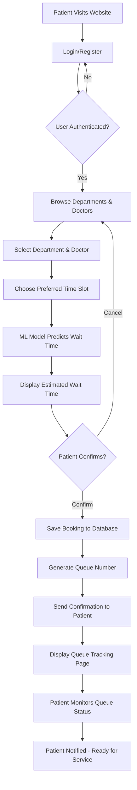
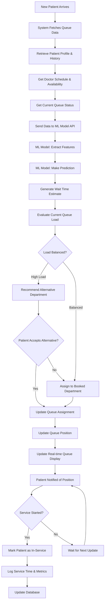
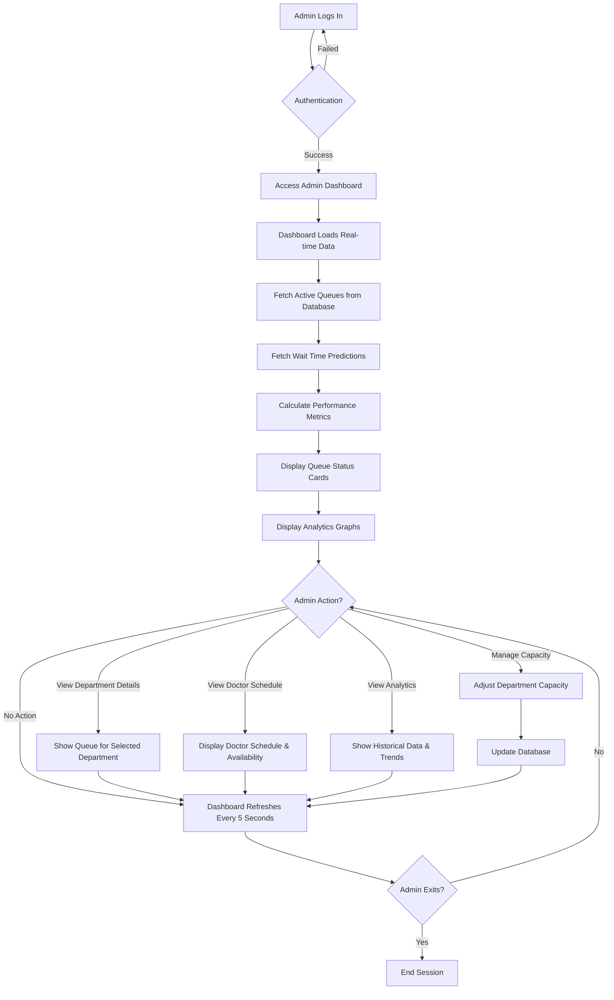
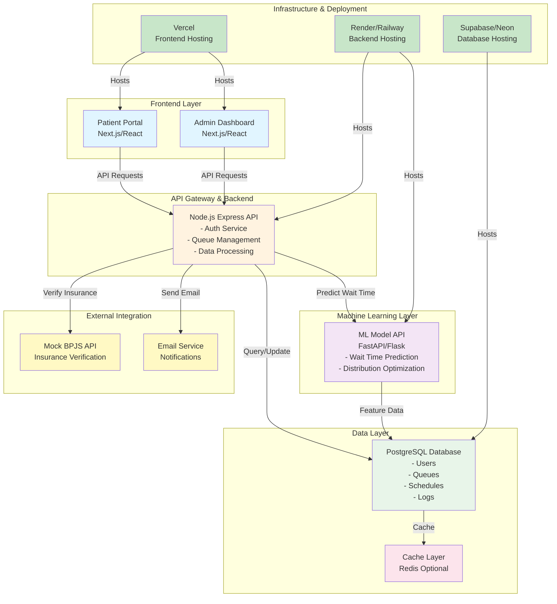
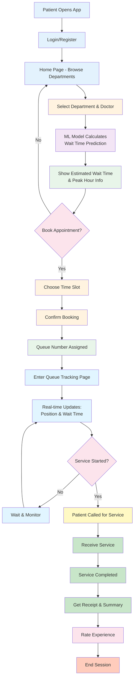
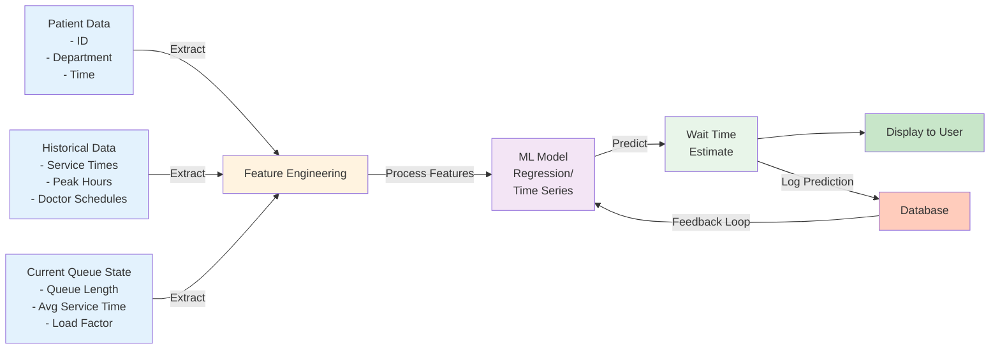
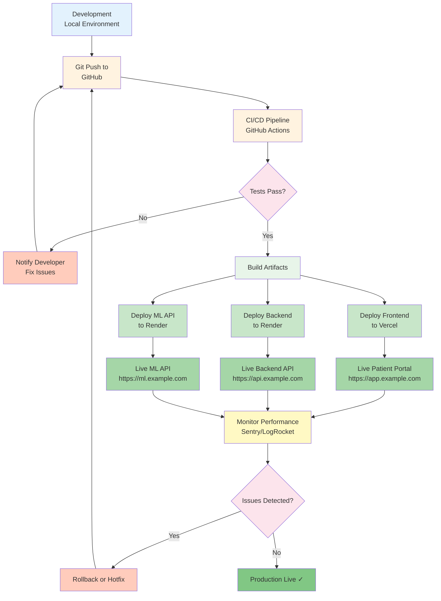
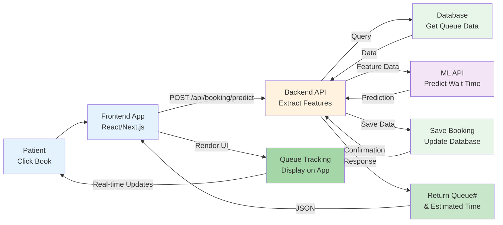
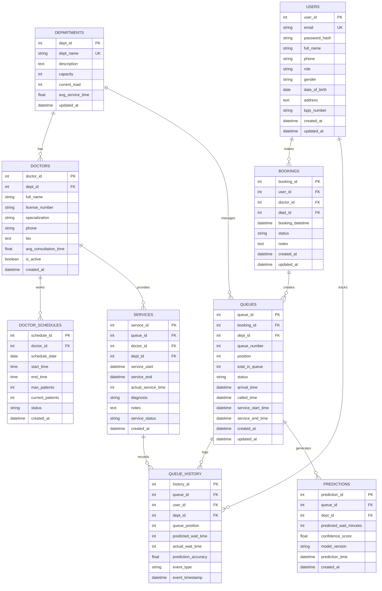

# Product Requirements Document (PRD)
## Intelligent Hospital Queue Management System

**Project ID:** CC26-PSU413  
**Theme:** Healthy Lives & Well-being  
**Program:** Coding Camp 2026 powered by DBS Foundation

---

## 1. Executive Summary

Hospital administration and queue management systems in Indonesia face significant challenges: long wait times, inefficient registration processes, and lack of patient transparency. The absence of predictive systems leads to uneven patient distribution and overload in specific departments, degrading service quality and patient experience.

This project develops a **Smart Healthcare Queue System** — a web-based platform that manages queue numbers, predicts wait times, and optimizes real-time patient distribution. It addresses root causes of operational inefficiency comprehensively, serving as a problem-solver rather than a superficial improvement.

### Key Research Questions
1. How can we build a queue system that visualizes wait time estimates accurately and in real-time?
2. How can we optimize patient distribution to reduce overload on specific services?
3. How can we improve patient information transparency to enhance their healthcare experience?

---

## 2. Problem Statement

### Current Pain Points
- **Long Wait Times:** Patients experience extended wait periods without accurate information
- **Inefficient Registration:** Manual and non-optimized booking processes
- **Lack of Transparency:** Patients cannot track queue status or estimated wait times
- **Poor Distribution:** No predictive system leads to uneven workload across departments
- **Limited Decision Support:** Staff lack real-time data for operational decisions

### Impact
- Reduced service quality and patient satisfaction
- Operational inefficiency and resource underutilization
- Poor patient experience during treatment

---

## 3. Product Vision & Objectives

### Vision
Create a data-driven, real-time hospital queue management system that improves operational efficiency and patient experience through intelligent queue distribution and transparent communication.

### Primary Objectives
1. **Reduce Wait Times:** Implement predictive models to accurately estimate and minimize patient wait times
2. **Optimize Operations:** Distribute patients intelligently to prevent department overload
3. **Enhance Transparency:** Provide patients with real-time queue status and wait time estimates
4. **Improve Decision-Making:** Equip hospital staff with actionable, real-time operational data

---

## 4. Product Scope

### In-Scope Features

#### 4.1 Queue Management
- Patient booking and registration via web interface
- Queue number assignment and management
- Real-time queue monitoring and visualization
- Department-based queue distribution

#### 4.2 Wait Time Prediction
- ML-based wait time estimation based on historical data
- Prediction model trained on patient visit patterns, service times, and doctor schedules
- Real-time prediction updates as patients move through the queue

#### 4.3 Patient Distribution Optimization
- Intelligent algorithm to distribute incoming patients across available services
- Load balancing to prevent department overload
- Recommendation system for optimal department routing

#### 4.4 User Interfaces
**Patient Portal:**
- Browse available departments and doctors
- Book appointment and obtain queue number
- Track queue status and wait time in real-time
- View estimated service completion time

**Admin Dashboard:**
- Monitor all active queues across departments
- View wait time metrics and performance analytics
- Manage doctor schedules and department capacity
- Generate operational insights and reports

#### 4.5 Backend Infrastructure
- RESTful API for queue management (CRUD operations)
- User authentication and authorization
- Database management for patients, doctors, schedules, and queue logs
- Integration layer for third-party services (mock BPJS API)

#### 4.6 Integration & Deployment
- Frontend deployment to Vercel
- Backend deployment to Render/Railway
- Database hosting on Supabase/Neon
- ML Model API integration with FastAPI/Flask

### Out-of-Scope Features

- Full BPJS integration (mock API only)
- Real-time AI model retraining in production
- Advanced features beyond MVP (SMS notifications, mobile app, etc.)
- Integration with existing hospital management systems
- Multi-language support beyond Indonesian/English
- Integration with hospital EMR systems

---

## 5. Key Features & Requirements

### 5.1 User Stories

#### Patient User Stories
**US1:** As a patient, I want to book an appointment and receive a queue number quickly so I can plan my visit efficiently.

**US2:** As a patient, I want to see my current queue position and estimated wait time so I can manage my time effectively.

**US3:** As a patient, I want to receive information about which department has shorter wait times so I can make informed decisions.

#### Admin User Stories
**US4:** As a hospital admin, I want to monitor all queues in real-time so I can identify bottlenecks and respond quickly.

**US5:** As a hospital admin, I want to see analytics on wait times and service metrics so I can make data-driven operational decisions.

**US6:** As a hospital admin, I want to manage doctor schedules and department capacities so I can optimize resource allocation.

### 5.2 Functional Requirements

| ID | Requirement | Priority | Component |
|----|-------------|----------|-----------|
| FR1 | System shall authenticate users (patients/admins) via secure login | High | Backend, Frontend |
| FR2 | System shall allow patients to book appointments with date/time selection | High | Frontend, Backend |
| FR3 | System shall assign unique queue numbers automatically | High | Backend |
| FR4 | System shall predict wait times using ML model with 80%+ accuracy | High | ML Model, Backend |
| FR5 | System shall display real-time queue status to all users | High | Frontend, Backend |
| FR6 | System shall recommend optimal department distribution based on current load | High | ML Model, Backend |
| FR7 | System shall maintain queue history for analytics | Medium | Database, Backend |
| FR8 | System shall support concurrent users without performance degradation | Medium | Backend, Infrastructure |
| FR9 | System shall integrate with mock BPJS API for insurance verification | Medium | Backend |
| FR10 | System shall provide admin dashboard with key performance metrics | High | Frontend, Backend |

### 5.3 Non-Functional Requirements

| ID | Requirement | Target |
|----|-------------|--------|
| NFR1 | Response Time | < 500ms for API calls |
| NFR2 | Availability | 99% uptime during business hours |
| NFR3 | Concurrent Users | Support 100+ simultaneous users |
| NFR4 | Database Query Time | < 1s for analytics queries |
| NFR5 | Security | HTTPS, password hashing (bcrypt), JWT authentication |
| NFR6 | Scalability | Auto-scaling backend to handle peak loads |
| NFR7 | Data Retention | 2 years of queue history |

---

## 6. Data Requirements

### Data Collection
- **Historical patient visit data:** arrival time, service duration, department, doctor
- **Doctor schedule data:** working hours, availability, service time per patient
- **Queue logs:** patient ID, department, queue position, wait time, service time

### Data Quality
- Data cleaning and preprocessing to handle missing values and outliers
- Exploratory data analysis (EDA) to identify patterns (peak hours, seasonal trends)
- Data validation and consistency checks

### Dummy Dataset Specifications
- Simulate 3-6 months of realistic hospital data
- Include various time patterns (weekdays, weekends, peak hours)
- Generate doctor availability and service time variations
- Create patient profiles with different characteristics

---

## 7. ML Model Requirements

### Wait Time Prediction Model
- **Input:** Patient characteristics, current queue state, doctor availability, historical patterns
- **Output:** Estimated wait time in minutes
- **Algorithm:** Regression-based (Linear Regression, Random Forest, or similar)
- **Target Accuracy:** MAE ≤ 15 minutes, RMSE acceptable within 20 minutes
- **Evaluation Metrics:** MAE (Mean Absolute Error), RMSE (Root Mean Squared Error), R² Score
- **Deployment:** Wrapped in FastAPI/Flask REST API

### Patient Distribution Model
- **Objective:** Minimize overall wait time and prevent service overload
- **Approach:** Rule-based or simple ML-based optimization
- **Output:** Recommendation for optimal department/doctor assignment

---

## 8. Technology Stack

### Frontend
- **Framework:** Next.js / React.js
- **Language:** JavaScript / TypeScript
- **UI Library:** Tailwind CSS, shadcn/ui (or similar)
- **State Management:** Redux / Zustand
- **Deployment:** Vercel

### Backend
- **Runtime:** Node.js
- **Framework:** Express.js / NestJS
- **Language:** JavaScript / TypeScript
- **Database:** PostgreSQL
- **Deployment:** Render / Railway
- **Database Hosting:** Supabase / Neon

### Machine Learning
- **Language:** Python
- **Data Processing:** Pandas, NumPy
- **ML Library:** Scikit-Learn
- **Model Serving:** FastAPI / Flask
- **Deployment:** Render / Railway

### Infrastructure
- **Authentication:** JWT (JSON Web Tokens)
- **API Protocol:** RESTful API
- **Version Control:** Git / GitHub
- **Containerization:** Docker (optional but recommended)

---

## 9. User Interface Requirements

### Patient Portal
- **Pages:** Landing, Login/Register, Dashboard, Booking, Queue Tracker
- **Key Features:**
  - Department selection with wait time preview
  - Appointment booking form
  - Real-time queue position display
  - Wait time countdown timer
  - Patient profile and history

### Admin Dashboard
- **Pages:** Login, Dashboard, Queue Monitor, Analytics, Settings
- **Key Features:**
  - Real-time queue status across all departments
  - Performance metrics (avg wait time, service rate, patient satisfaction)
  - Department workload visualization
  - Doctor schedule management
  - Historical data analytics and reports

---

## 10. Integration Points

### External APIs
- **BPJS Insurance API** (Mock): Patient insurance verification
- **Email Service** (Optional): Appointment confirmation and notifications
- **Cloud Services:** Vercel (frontend), Render (backend), Supabase (database)

### Internal Integration
- **Frontend ↔ Backend:** RESTful API calls
- **Backend ↔ ML Model:** API endpoint calls for predictions
- **Backend ↔ Database:** ORM queries (e.g., Prisma, TypeORM)

---

## 11. Success Metrics & KPIs

| Metric | Target | Measurement |
|--------|--------|-------------|
| Wait Time Prediction Accuracy | MAE ≤ 15 minutes | Model evaluation metrics |
| System Uptime | ≥ 99% | Monitoring tools (Sentry, etc.) |
| Page Load Time | < 2s | Frontend monitoring |
| User Satisfaction | ≥ 4/5 stars | User surveys |
| API Response Time | < 500ms | Backend monitoring |
| Concurrent User Support | 100+ | Load testing results |
| Patient Booking Completion Rate | ≥ 95% | Analytics tracking |

---

## 12. Development Roadmap & Phases

### Phase 1: Planning & Setup (Week 1-2)
- Finalize requirements and design
- Setup development environment
- Create data schema and database design
- Prepare dummy dataset

### Phase 2: Backend Development (Week 2-4)
- Setup Node.js/Express backend structure
- Implement authentication system
- Build queue management APIs
- Setup PostgreSQL database

### Phase 3: Frontend Development (Week 2-5)
- Design UI/UX in Figma
- Build patient portal interface
- Build admin dashboard interface
- Integrate with backend APIs

### Phase 4: ML Model Development (Week 2-4)
- Data exploration and analysis (EDA)
- Feature engineering
- Train wait time prediction model
- Wrap model in FastAPI/Flask

### Phase 5: Integration & Testing (Week 5-6)
- Integrate frontend, backend, and ML components
- Comprehensive testing (unit, integration, system)
- Bug fixes and optimization
- Load testing

### Phase 6: Deployment & Launch (Week 6-7)
- Deploy frontend to Vercel
- Deploy backend to Render
- Deploy ML API to cloud
- Monitor and support

---

## 13. Risk Management

### Identified Risks

| Risk | Probability | Impact | Mitigation Strategy |
|------|-------------|--------|---------------------|
| ML Model Accuracy Below Target | Medium | High | Early model evaluation, alternative algorithms |
| Database Performance Issues | Medium | High | Query optimization, indexing strategy, caching |
| Integration Delays | Medium | Medium | Early integration testing, clear API contracts |
| Deployment Issues | Low | High | Infrastructure documentation, rollback plan |
| Team Availability | Low | Medium | Clear task allocation, progress monitoring |
| Scope Creep | Medium | Medium | Strict scope management, MVP focus |

### Risk Mitigation Actions
1. **Daily standup meetings** to monitor progress and identify blockers early
2. **Regular integration testing** to catch issues before final integration
3. **Documentation** of all APIs and system components
4. **Backup plans** for critical functionalities
5. **Load testing** to validate system scalability

---

## 14. Constraints & Assumptions

### Constraints
- **MVP Focus:** Project limited to Minimum Viable Product (MVP) scope
- **Dummy Data:** Uses simulated dataset, not production hospital data
- **Mock Integration:** BPJS integration is simulation-based only
- **Development Timeline:** Limited to capstone project duration (6-8 weeks)

### Assumptions
- Hospital has basic IT infrastructure and internet connectivity
- Users (patients/staff) are comfortable with web interfaces
- Team has necessary technical skills in full-stack development, data science, and ML
- Dummy dataset accurately represents realistic hospital scenarios

---

## 15. Acceptance Criteria

The project is considered successful when:

✅ **Functional Completeness**
- All functional requirements (FR1-FR10) implemented and tested
- Patient portal fully functional for booking and queue tracking
- Admin dashboard provides real-time monitoring capabilities

✅ **Performance Standards**
- Page load times < 2 seconds
- API response times < 500ms under normal load
- System supports 100+ concurrent users

✅ **ML Model Quality**
- Wait time prediction MAE ≤ 15 minutes
- Model evaluation metrics meet or exceed targets

✅ **Quality Assurance**
- All critical and high-priority bugs fixed
- Code coverage ≥ 80% for backend services
- Security vulnerabilities resolved

✅ **Deployment & Accessibility**
- Frontend accessible via public Vercel URL
- Backend APIs functional and accessible
- Database properly configured and backed up

✅ **Documentation**
- API documentation complete
- System architecture documented
- Deployment guide provided

---

## 16. Glossary

| Term | Definition |
|------|-----------|
| **Queue** | Ordered list of patients waiting for service |
| **Wait Time** | Estimated duration a patient waits before service begins |
| **Service Time** | Duration of actual service/consultation |
| **Peak Hour** | Time period with highest number of patient arrivals |
| **Department** | Specialized service unit within the hospital (e.g., Cardiology, Pediatrics) |
| **Queue Number** | Unique identifier assigned to patient for tracking |
| **ML Model** | Trained artificial intelligence model for wait time prediction |
| **API** | Application Programming Interface for system integration |
| **MVP** | Minimum Viable Product with essential features only |

---

## Appendices
- **Flowcharts & System Diagrams**
## 1. Patient Booking Flow

---

## 2. Queue Management & Wait Time Prediction Flow

---

## 3. Admin Dashboard Monitoring Flow

---

## 4. System Architecture & Integration Flow

---

## 5. End-to-End User Journey Flow

---

## 6. Data Flow - Wait Time Prediction

---

## 7. System Deployment Flow

---

## 8. API Request-Response Flow (Booking & Queue Tracking)

---

## Supplementary: Complete API Endpoint Reference

| Endpoint | Method | Purpose | Request | Response |
|----------|--------|---------|---------|----------|
| `/api/auth/login` | POST | Patient/Admin login | `{email, password}` | `{token, user}` |
| `/api/auth/register` | POST | New patient registration | `{name, email, password}` | `{token, user}` |
| `/api/departments` | GET | List all departments | - | `[{id, name, wait_time}]` |
| `/api/doctors` | GET | List doctors by department | `{dept_id}` | `[{id, name, specialty}]` |
| `/api/booking/predict` | POST | Predict wait time & book | `{dept_id, doctor_id, time}` | `{queue_num, wait_time}` |
| `/api/queue/status` | GET | Get queue position & status | `{queue_number}` | `{position, wait_time, status}` |
| `/api/queue/all` | GET | Admin: all active queues | - | `[{dept, position, count}]` |
| `/api/admin/metrics` | GET | Admin: performance metrics | - | `{avg_wait, throughput, load}` |
| `/api/admin/schedule` | PUT | Manage doctor schedules | `{doctor_id, schedule}` | `{success, updated}` |

---

## Legend

🟦 Blue = Frontend/User Interface  
🟧 Orange = API/Backend Processing  
🟪 Purple = Machine Learning  
🟩 Green = Database/Storage  
🟨 Yellow = External Services  
🟩 Light Green = Deployment/Production

- **Database Schema**
## ER Diagram

- Design Document (Figma Designs) - *To be created*
- API Specification - *To be created*
- ML Model Documentation - *To be created*
- Deployment Guide - *To be created*

---

**Document Version:** 1.0  
**Last Updated:** April 2026  
**Next Review:** Upon completion of Phase 1

