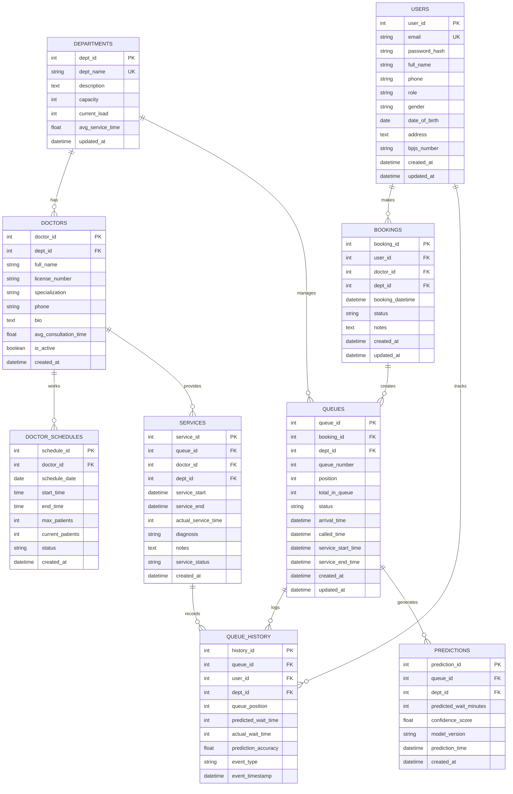

# Hospital Queue Management System - Database Schema

## ER Diagram

```mermaid
erDiagram
    USERS ||--o{ BOOKINGS : makes
    USERS ||--o{ QUEUE_HISTORY : tracks
    DEPARTMENTS ||--o{ DOCTORS : has
    DEPARTMENTS ||--o{ QUEUES : manages
    DOCTORS ||--o{ DOCTOR_SCHEDULES : works
    DOCTORS ||--o{ SERVICES : provides
    BOOKINGS ||--o{ QUEUES : creates
    QUEUES ||--o{ QUEUE_HISTORY : logs
    SERVICES ||--o{ QUEUE_HISTORY : records
    QUEUES ||--o{ PREDICTIONS : generates

    USERS {
        int user_id PK
        string email UK
        string password_hash
        string full_name
        string phone
        string role
        string gender
        date date_of_birth
        text address
        string bpjs_number
        datetime created_at
        datetime updated_at
    }

    DEPARTMENTS {
        int dept_id PK
        string dept_name UK
        text description
        int capacity
        int current_load
        float avg_service_time
        datetime updated_at
    }

    DOCTORS {
        int doctor_id PK
        int dept_id FK
        string full_name
        string license_number
        string specialization
        string phone
        text bio
        float avg_consultation_time
        boolean is_active
        datetime created_at
    }

    DOCTOR_SCHEDULES {
        int schedule_id PK
        int doctor_id FK
        date schedule_date
        time start_time
        time end_time
        int max_patients
        int current_patients
        string status
        datetime created_at
    }

    BOOKINGS {
        int booking_id PK
        int user_id FK
        int doctor_id FK
        int dept_id FK
        datetime booking_datetime
        string status
        text notes
        datetime created_at
        datetime updated_at
    }

    QUEUES {
        int queue_id PK
        int booking_id FK
        int dept_id FK
        int queue_number
        int position
        int total_in_queue
        string status
        datetime arrival_time
        datetime called_time
        datetime service_start_time
        datetime service_end_time
        datetime created_at
        datetime updated_at
    }

    SERVICES {
        int service_id PK
        int queue_id FK
        int doctor_id FK
        int dept_id FK
        datetime service_start
        datetime service_end
        int actual_service_time
        string diagnosis
        text notes
        string service_status
        datetime created_at
    }

    QUEUE_HISTORY {
        int history_id PK
        int queue_id FK
        int user_id FK
        int dept_id FK
        int queue_position
        int predicted_wait_time
        int actual_wait_time
        float prediction_accuracy
        string event_type
        datetime event_timestamp
    }

    PREDICTIONS {
        int prediction_id PK
        int queue_id FK
        int dept_id FK
        int predicted_wait_minutes
        float confidence_score
        string model_version
        datetime prediction_time
        datetime created_at
    }
```